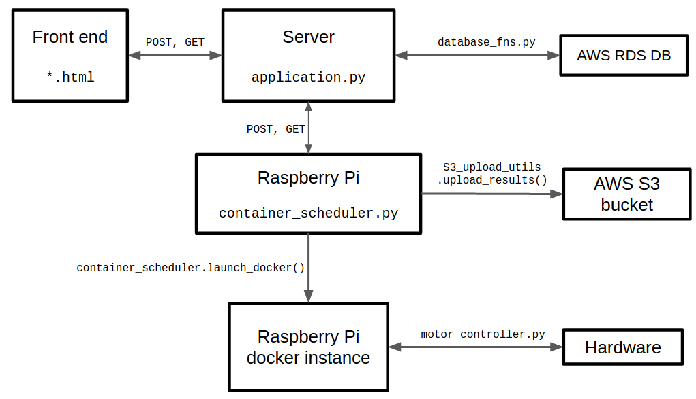

# Reality as a Service (RaaS)

Reality as a Service (RaaS) is an open source platform for hosting physical OpenAI Gym environments. A few motivations for it are:

* it lowers the barrier to transitioning to real robots in both effort and cost,
* it allows the outsourcing of maintenance of robots to specialists,
* it amortizes the cost of robots over more researchers and RL practitioners, and
* it results in less down-time for expensive robots

The robot is controlled via a custom gym environment found [here](https://github.com/perciplex/gym-raas). It is designed to be a simple drop-in replacement for the usual OpenAI gym, having the same API as the corresponding OpenAI gym environment.

Try out RaaS here! [raas.perciplex.com](http://raas.perciplex.com).


## Getting Started


### Install Gym Environment
We use the same interface as OpenAI Gym with a [custom environment](https://github.com/perciplex/gym-raas).
To install the simulated gym-raas environment first install the standard [OpenAI gym](https://gym.openai.com/docs/):
```sh
pip3 install gym
```

Then clone and install our custom environment:

```sh
git clone https://github.com/perciplex/gym-raas
cd gym_raas
pip3 install -e .
```

### Make a Controller

To start a new gym-raas controller, create a new project on Github or fork (it's a button in the right upper corner) our [starter repository on GitHub](https://github.com/perciplex/raas-starter). Either way, you must include `run.py` at the root directory of the repo which is the entrypoint invoked by our RaaS servers.

gym-raas implements an identical interface to the standard OpenAI gym. See [their documentation](https://gym.openai.com/docs/) for more information. The following implements a simple random controller

```
python
import gym
import gym_raas

env = gym.make('raaspendulum-v0')
env.reset()

for _ in range(1000):
  env.render()
  env.step(env.action_space.sample()) # take a random action

env.close()
```

When run locally, the above code performs a Gym simulation with physical parameters set to match our hardware. When run at RaaS, the code controls an actual robot! The gym-raas environment automatically detects when hardware is available, so no code changes are necessary to transfer from simulation to hardware. In addition, it will add a 0.05 second delay between each call to `env.step` in order to maintain real-time control at a rate that matches the simulation.

You may be interested in some of our other example projects:

- [https://github.com/perciplex/raas-example](https://github.com/perciplex/raas-example) - An energy shaping swing-up controller
- [https://github.com/perciplex/raas-rwg](https://github.com/perciplex/raas-rwg) - A controller built by random guessing weights in a neural network


### Submit Job

To submit, copy the url of your repo into our [job submit page](https://raas.perciplex.com/#/submit).


## How It Works

The [webpage](http://raas.perciplex.com) is hosted on an AWS server which is constantly being pinged by a fleet of Raspberry Pis.

The server is responsible for taking POST requests for new jobs, maintaining a queue of jobs, and serving data from completed jobs. Its code may be found in the [/server](https://github.com/perciplex/raas/tree/master/server) folder.

The Raspberry Pis have a python program running called [container_scheduler.py](https://github.com/perciplex/raas/blob/master/docker_driver/container_scheduler.py). This program queries the server to pop jobs off the queue. It loads up an Ubuntu [docker image](https://github.com/perciplex/raas/tree/master/docker_driver/docker_images) which builds your project by cloning your Github repo and invoking `python3 run.py` with a timeout of 120 seconds. Upon job completion, the data of the job is sent to an S3 bucket.

The motor is controlled by a program called [motor_controller.py](https://github.com/perciplex/raas/blob/master/docker_driver/motor_controller.py) which communicates with the docker container via ZeroMQ. It in turn uses the [pigpiod daemon](http://abyz.me.uk/rpi/pigpio/pigpiod.html) for low level control of the motor and sensing of the encoder.



## Building Your Own Pendulum

The pendulum is built using easily available hardware. The following are instructions for purchase and assembly.

### Bill of Materials:

- Raspberry Pi (We use a Pi 4)
  + Power Supply for Pi
  + SD card for Pi
- L298N Motor Driver Board.
- Ribbon cable
- Gearbox Motor with built in encoder. 12V 600 RPM
- 12V Power Supply
- Power supply female donkus plug. DC Power Jack Plug adapter
- Wire
- Paint Stirrer Rod. Only the best for us!
- Mounting 2x4
- 4mm Flange Shaft Coupling
- 25mm DC Gearbox Motor Bracket
- 4x m3 12mm nuts and bolts
- Mounting nuts

[Here is an Amazon shopping cart link with the materials.](https://www.amazon.com/ideas/amzn1.account.AHWUEKBOXRZZ2YOBITVMXOZ7P2XA/2R26EST3LRFIO)

More information can be found in the [hardware](https://github.com/perciplex/raas/tree/master/hardware) folder of the repo.

## Learning More

- [OpenAI Spinning Up in Deep RL](https://spinningup.openai.com/)
- [Reinforcement Learning: An Introduction by Sutton and Barto](http://www.incompleteideas.net/book/the-book-2nd.html)
- [Underactuated Robotics](http://underactuated.mit.edu/)
- [Steve Brunton's Control Theory Channel](https://www.youtube.com/channel/UCm5mt-A4w61lknZ9lCsZtBw)
